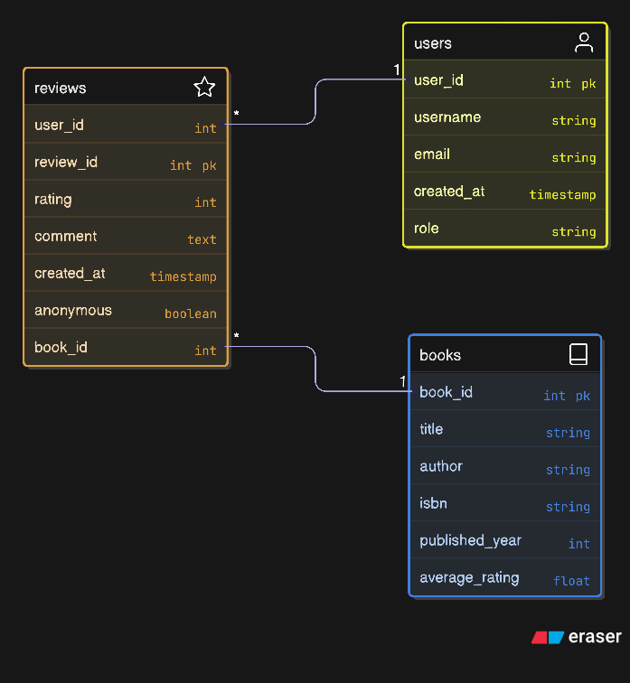

# flask-book-review-api
A simple Flask API for managing book reviews using a MySQL backend.

### Database ERD



### Features

- **Book Management**: Add and view books (admin only for adding)
- **User Management**: Create and view users
- **Role-based Access**: Admin authentication for book operations
- **Anonymous Reviews**: Option to post reviews anonymously


### Installation

1. **Clone the repository**
   ```bash
   git clone https://github.com/sakaleshhubli/flask-book-review-api.git
   cd book-review-api
   ```

2. **Install dependencies**
   ```bash
   pip install -r requirements.txt
   ```

3. **Set up MySQL Database**
   - Create a MySQL database named `flaskapi`
   - Update database credentials as shown in picture
  
4. **Run the program**
   - ```bash
     flask run --debug
     ```


## API Endpoints


| Method | Endpoint | Description |
|--------|----------|-------------|
| GET | `/` | Welcome message and instructions |
| GET | `/tables` | List all database tables |
| GET | `/tables/<table_name>` | View contents of specific table |
| GET | `/books` | View all books |
| GET | `/users` | View all users |
| GET | `/reviews` | View all reviews |
| POST | `/adduser` | Create a new user |
| POST | `/addreview` | Add a book review |
| POST | `/addbook` | Add a new book (admin only) |


The API returns appropriate HTTP status codes:
- `200`: Success
- `201`: Created
- `400`: Bad Request (missing required fields)
- `403`: Forbidden (insufficient permissions)
